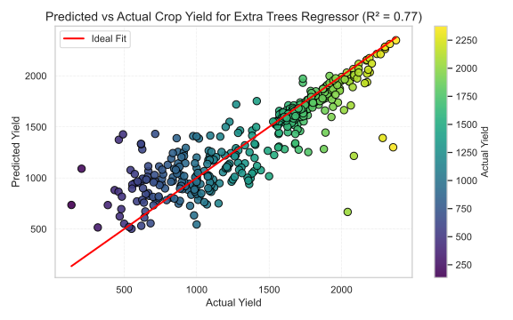
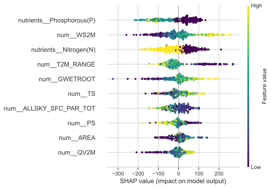
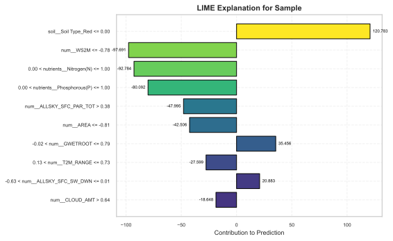
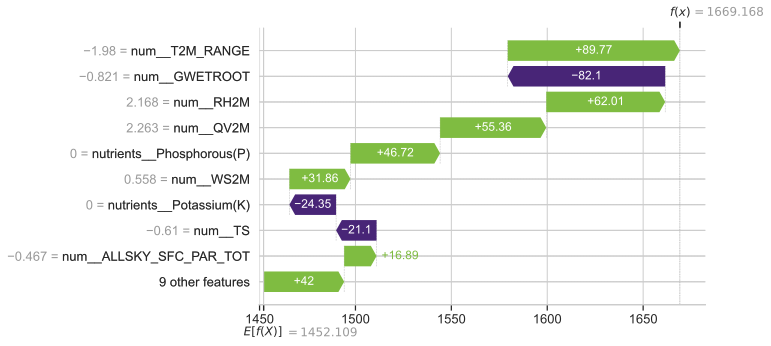

# 🌾 Soybean Yield Prediction with Model Interpretability (SHAP & LIME)

This project presents an interpretable machine learning pipeline for **soybean crop yield prediction** in the Indian states of **Maharashtra** and **Madhya Pradesh**. It uses ensemble regression models, synthetic oversampling (SMOGN), and interpretable AI techniques like **SHAP** and **LIME** to make predictions both **accurate** and **explainable**.

## 📌 Project Highlights

- 🔍 Predictive modeling using Extra Trees, Random Forest, XGBoost, SVR, Lasso, Ridge, KNN
- ⚖️ Synthetic oversampling with **SMOGN** to address imbalanced yield distribution
- 🧠 Best model: **Extra Trees Regressor** with **R² = 0.81**
- 🌾 Key features: **Soil nutrients (N, P)**, **Temperature range**, **Wind speed**
- 💡 Interpretable predictions with **LIME** (local) and **SHAP** (global & local)

## 📊 Model Performance

| Model            | MAE    | RMSE   | R²   |
|------------------|--------|--------|------|
| Extra Trees      | 150.4  | 234.7  | 0.81 |
| Random Forest    | 173.1  | 255.3  | 0.77 |
| XGBoost          | 193.9  | 274.6  | 0.77 |
| K Neighbors      | 208.3  | 314.3  | 0.65 |
| SVR              | 354.5  | 458.7  | 0.26 |
| Ridge Regression | 338.6  | 433.6  | 0.34 |
| Lasso Regression | 339.6  | 434.4  | 0.34 |

## 🖼️ Results Visualization

### 📈 Actual vs Predicted Yield (Extra Trees Regressor)

This scatter plot demonstrates how well the Extra Trees Regressor aligns with real-world data, especially in the medium-to-high yield range.

## 🔍 Model Interpretability

### 🌍 SHAP Global Summary

SHAP highlights the **most influential features** across all predictions:
- 🌡️ Temperature Range (T2M_RANGE)
- 💨 Wind Speed (WS2M)
- 🧪 Soil Nutrients (N, P)
- 💧 Root Zone Soil Wetness (GWET_ROOT)

### 🧩 LIME Local Explanation

LIME provides **instance-specific insight**. In this example, presence of red soil increases yield whereas presence of phosphorus & nitrogen decreases it.

### 🔬 SHAP Local Explanation (Waterfall Plot)

SHAP’s local explanation for a single prediction, breaking down how each feature pushed the prediction higher or lower relative to the base value. The temperature difference increases yield whereas root zone wetness decreases it for this particular example.

## 🧪 Dataset & Features

- **Region**: 88 districts from Maharashtra and Madhya Pradesh
- **Features**: 
  - 📊 Climatic: temperature, wind speed, solar radiation, humidity
  - 🌱 Soil: nitrogen, phosphorus, soil type
  - 🧭 Geospatial: cultivated area, soil wetness

## 🛠️ Methodology

1. **Data Preprocessing**: Cleaning, encoding, scaling
2. **SMOGN**: Synthetic sampling for regression
3. **Model Training**: Ensemble + Linear models with cross-validation
4. **Evaluation**: MAE, MSE, RMSE, R²
5. **Interpretability**: LIME for local, SHAP for global + local explanation

## 🎯 Applications

- 📍 Precision Agriculture
- 📉 Crop risk mitigation
- 🌾 Soil and fertilizer management
- 🧭 Policy-level decision support

## 📚 References

- SMOGN: Torgo, L., et al. (2017)
- SHAP: Lundberg, S.M., & Lee, S.-I. (2017)
- LIME: Ribeiro, M.T., Singh, S., & Guestrin, C. (2016)

## 🧠 Future Work

- 🌐 Add remote sensing and satellite features
- 🛰️ Spatio-temporal model integration
- 🧬 Try deep learning architectures (CNNs, LSTMs)
- 🚀 Real-time deployment with interactive dashboards

## 📜 License

This project is licensed under the [MIT License](LICENSE).
